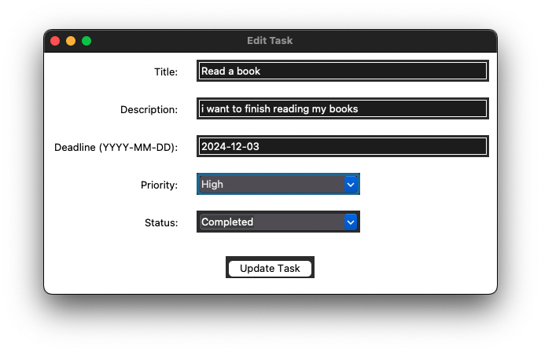

# Task Manager Project

## Overview

The **Task Manager Project** is an accessible and user-friendly task management application developed in Python, following the **Model-View-Controller (MVC)** architecture. Designed to help users organize, prioritize, and manage their tasks efficiently, the application emphasizes accessibility to cater to a wide range of users.

### Why MVC Architecture?

We chose the MVC (Model-View-Controller) architecture for several reasons:

- **Separation of Concerns**: MVC separates the application into three interconnected components:
  - **Models**: Handle data logic and interact with the database.
  - **Views**: Manage the user interface and presentation.
  - **Controllers**: Act as intermediaries between models and views, processing user input and updating the model and view accordingly.
- **Maintainability**: With a clear separation, it's easier to modify or extend parts of the application without affecting others.
- **Scalability**: Allows the application to grow in complexity by adding new features or components.
- **Testability**: Simplifies unit testing by isolating components.

## Features

- **Add, Edit, and Delete Tasks**: Manage your tasks with ease.
- **Task Prioritization**: Assign priorities (High, Medium, Low) to focus on important tasks.
- **Deadline Management**: Set deadlines and receive timely notifications.
- **Accessible Design**: High-contrast themes, adjustable font sizes, and minimalist layouts.
- **Notifications**: Reminders for upcoming task deadlines.
- **Progress Visualization**: View statistics and progress through intuitive charts.

## Project Structure

```
project/
├── main.py                    # Entry point of the application
├── setup.py                   # Installation script
├── models/
│   ├── task_model.py          # Task data model
├── views/
│   ├── task_manager_gui.py    # Main GUI window
│   ├── task_form.py           # Form to add new tasks
│   ├── task_view.py           # Displays list of tasks
│   └── edit_task_form.py      # Form to edit existing tasks
├── controllers/
│   ├── task_controller.py     # Handles task operations
├── utils/
│   ├── database.py            # Database interactions
│   ├── notifications.py       # Notification scheduling
│   └── visualizations.py      # Generates progress visuals
└── README.md                  # Project documentation
```

### Directory Breakdown

- **main.py**  
  The entry point of the application. Initializes the main GUI and notification manager.

- **setup.py**  
  Script used for installing the application and its dependencies.

- **models/**  
  Contains data models representing core data structures.

  - `task_model.py`: Defines the `Task` class representing a task entity.

    ```python:models/task_model.py
    class Task:
        def __init__(self, id, title, description, deadline, priority='Low', status='Pending'):
            self.id = id
            self.title = title
            self.description = description
            self.deadline = deadline
            self.priority = priority
            self.status = status

        def mark_complete(self):
            self.status = 'Completed'
    ```

  - `preferences_model.py`: Manages user preferences and settings.

- **views/**  
  Contains GUI components built using Tkinter.

  - `task_manager_gui.py`: Sets up the main application window and integrates other views.

    ```python:views/task_manager_gui.py
    class TaskManagerGUI(tk.Tk):
        def __init__(self, task_controller):
            super().__init__()
            self.task_controller = task_controller
            self.title("YOUR TASKS")
            self.configure(bg='#f0f0f0')
            self.create_header()
            self.create_current_tasks_section()
            self.create_completed_tasks_section()
            self.refresh_tasks()
        ...
    ```

  - `task_form.py`: Provides a form for adding new tasks.

  - `task_view.py`: Displays the list of tasks in a table format.

  - `edit_task_form.py`: Provides a form for editing existing tasks.

- **controllers/**  
  Handles the interaction between models and views.

  - `task_controller.py`: Manages task-related operations.

    ```python:controllers/task_controller.py
    class TaskController:
        def __init__(self):
            self.db = Database()
            self.db.create_tasks_table()
        ...
    ```

  - `preferences_controller.py`: Manages user preferences.

- **utils/**  
  Provides utility modules supporting various functionalities.

  - `database.py`: Handles database connections and operations using SQLite.

  - `notifications.py`: Manages scheduling and sending task reminders.

  - `visualizations.py`: Generates visual representations of task progress.

## Getting Started

### Prerequisites

- **Python 3.6 or higher**  
  Ensure you have Python 3 installed on your machine.

### Installation

1. **Clone the Repository**

   ```bash
   git clone https://github.com/shirleychen003/task-manager
   cd task-manager
   ```

2. **Install the Application**

   Run the setup script to install dependencies and the application:

   ```bash
   python setup.py install
   ```

3. **Install Required Libraries**

   The application uses Tkinter for the GUI, which typically comes pre-installed with Python. If not, install it via your package manager.

   - **For Windows:**  
     Tkinter is included with Python installations.

   - **For macOS:**  

     ```bash
     brew install python-tk
     ```

   - **For Linux (Debian/Ubuntu):**  

     ```bash
     sudo apt-get install python3-tk
     ```

### Running the Application

After installation, you can run the application using:

```bash
python main.py
```

## Usage

1. **Adding a Task:**

   - Open the application.
   - Click on **"Add Task"** to open the task form.
   - Fill in the task details and click **"Submit"**.

2. **Viewing Tasks:**

   - The main window displays all current tasks.
   - Use the **"Tasks"** tab to switch between pending and completed tasks.

3. **Editing a Task:**

   - Select a task from the list.
   - Click on **"Edit Task"** to modify the task details.

   ```python:views/edit_task_form.py
   class EditTaskForm(tk.Frame):
       def update_task(self):
           # Collect updated data and validate
           self.task_controller.edit_task(self.task.id, updated_data)
           messagebox.showinfo("Success", "Task updated successfully.")
           self.parent.destroy()
   ```

4. **Deleting a Task:**

   - Select a task from the list.
   - Click on **"Delete Task"** and confirm the deletion.

5. **Marking a Task as Complete:**

   - Select a task from the list.
   - Click on **"Mark Complete"** to update the task status.

6. **Clearing All Tasks (for testing purposes):**

   - To clear all tasks from the database, run:

     ```bash
     python clear_db.py
     ```

   - This will remove both pending and completed tasks.
   - Use with caution as this action cannot be undone.

## Example Output Screenshots

Below are some example screenshots of the Task Manager application in action.

### Main Application Window


*The main window displays your current tasks and allows you to add, edit, or delete tasks easily.*

### Adding a New Task


*The "Add Task" form lets you input the task details, including title, description, deadline, and priority.*

### Editing an Existing Task



*You can edit any existing task to update its details or change its status.*

### Deleting a Task


*Pop-up window will ask you to confirm the deletion of the task.*

### Sorting Tasks by Deadline


*You can sort the tasks by deadline to see which tasks are due soonest.*

### Sorting Tasks by Priority


*You can sort the tasks by priority to see which tasks are most important.*


## Accessibility Features

- **Themes and Stylesheets:** Offers light and dark themes for visual comfort.
- **Adjustable Font Sizes:** Increase or decrease font sizes for readability.
- **High-Contrast Options:** Enhances visibility for users with visual impairments.
- **Minimalist Design:** Clean interface to reduce cognitive load.

## Contributing

Contributions are welcome! If you have suggestions or improvements, feel free to open an issue or submit a pull request.

## License

This project is licensed under the [MIT License](LICENSE).

## Acknowledgments

- **Python Tkinter Documentation:** For GUI development references.
- **Python Standard Library:** Utilized modules like `sqlite3`, `threading`, and `json`.
- **INF452 Class:** Inspired by coursework and project guidelines.

